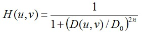
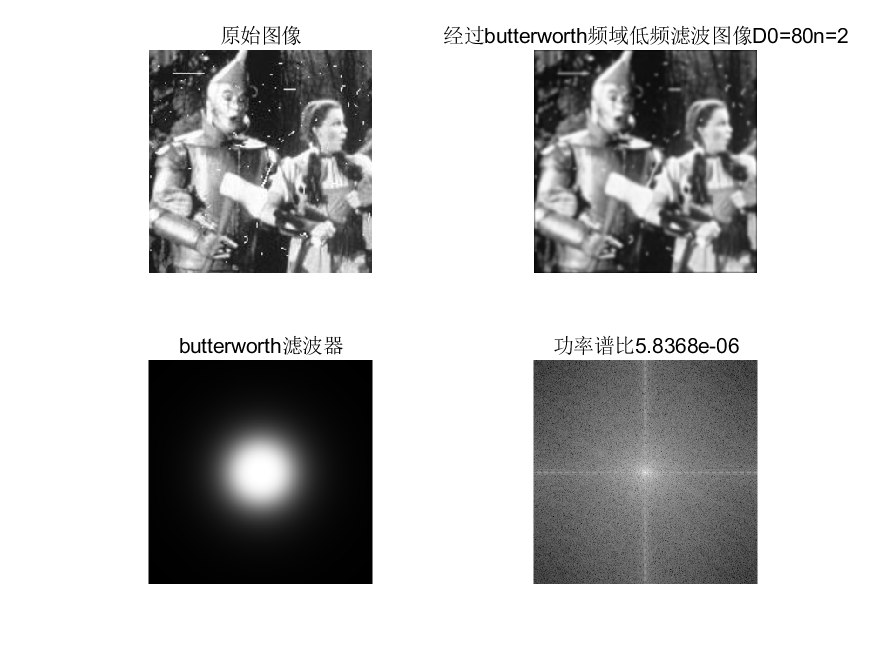

#                             数字图像处理第五次作业

**摘要：**

**设计低通滤波器滤除图片中的高频信息主要包括噪声，边缘。也可以灵活利用高通滤波器提取边缘。butterworth
and
Gaussian滤波器应用广泛，根据实际情况合理的选择滤波器能够事半功倍。空域与频域滤波的区别在于空域滤波是针对每一个像素点的操作，而频域滤波则是对整个图像中的某种频率成分进行操作。**

**                                                                                                                                             姓名：赵毅**

**                                                                                                                                              班级：自动化64**

**                                                                                                                                             学号：2160504108**

​                                   **                                                                                                           提交日期：2019/4/1**

1频域低通滤波器：设计低通滤波器包括 butterworth and Gaussian
(选择合适的半径，计算功率谱比),平滑测试图像test1和2;分析各自优缺点；

实验原理及方法
低通滤波器是要保留图片中的低频分量滤去不需要的高频分量，高频分量包括图像中的边缘，噪声等。这些都对应着傅里叶图像中的高频图像，理想的低通滤波器

【题目分析】

 其中，D0表示通带的半径。D(u,v)的计算方式也就是两点间的距离，很简单就能得到。

       低通滤波器滤除了高频成分，所以使得图像模糊。

巴特沃斯低通滤波器

同样的，D0表示通带的半径，n表示的是巴特沃斯滤波器的次数。随着次数的增加，振铃现象会越来越明显。

高斯低通滤波器

 D0表示通带的半径。高斯滤波器的过度特性非常平坦，因此是不会产生振铃现象的。

【图像展示】

选取D0=80,N=2进行试验。图像如下图所示；

【结果分析】

对图像进行分析发现在D0=80,n=2时，对第一幅图像滤波器能够有效的将图像噪声减少，对于第二幅图像，低通滤波使得图像变得模糊，图像边缘变得不清晰。第一幅图的功率谱比的值大于第二幅图像。功率谱比越大的图像，滤波效果越好。相同条件下，高斯低通滤波器的效果较好，更清晰，得到图像的细节更丰富。

2频域高通滤波器：设计高通滤波器包括butterworth and
Gaussian，在频域增强边缘。选择半径和计算功率谱比，测试图像test3,4：分析各自优缺点；

【题目分析】

对于高通滤波器，其函数特性与低通滤波器正好相反。根据第一题的相应结果，进行操作。

【图像展示】

对高通滤波器的分析发现，对频域的高通滤波能够有效的将边缘信息提取出来。

3其他高通滤波器：拉普拉斯和Unmask，对测试图像test3,4滤波；分析各自优缺点；

拉普拉斯高通滤波的公式为

$$
H\left( u,v \right) = - 4\pi^{2}\left( u^{2} + v^{2} \right)
$$

关于频率矩形的中心，使用如下滤波器可以实现

$$
H\left( u,v \right) = - 4\pi^{2}\left\lbrack \left( u - P \slash 2 \right)^{2} + \left( v - Q \slash 2 \right)^{2} \right\rbrack
$$

在频率域可以写成

$$
g\left( x,y \right) = \mathcal{L}^{- 1}\{\lbrack 1 + 4\pi^{2}D^{2}\left( u,v \right)\rbrack F\left( u,v \right)\}
$$

根据公式进行编程计算

Unmask滤波器的计算公式为

$$g\left( x,y \right) = f\left( x,y \right) + k*g_{\max}\left( x,y \right)$$ k=1

【结果展示】

比较并讨论空域低通高通滤波( Project4)与频域低通和高通的关系。

频域滤波与空域滤波通过卷积定理联系在一起。空域滤波器和频率域的滤波器通过傅里叶变换进行变换。空间域中的滤波为滤波函数h(x，y)与输入图像f(x，y)进行卷积；频率域中的滤波为滤波函数H(u，v)与输入图像傅里叶变换F（u，v)进行相乘。空域滤波器可借助频域分析设计；空域滤波器也可以通过到频域实现，

频域滤波分析图像的频率成分与图像的视觉效果间的对应关系比较直观。容易进行观察。空域滤波在具体实现上和硬件设计上有一定优点。

区别：空域滤波是针对每一个像素点的操作，而频域滤波则是对整个图像中的某种频率成分进行操作。

